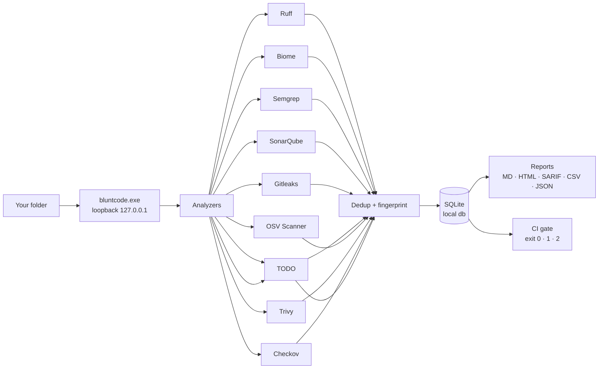

<p align="center">
  
</p>

<h1 align="center">Blunt Code</h1>

<p align="center">
  <strong>Your code has problems. Blunt Code names them.</strong><br/>
  Local-first code quality & security scanning for Windows — no cloud, no account, no telemetry.
</p>

<p align="center">
  <a href="https://github.com/sanketpatel32/Blunt-code/releases"></a>
  
  
  
  
</p>

<p align="center">
  <a href="https://sanketpatel32.github.io/Blunt-code/">Website</a> ·
  <a href="#-install">Install</a> ·
  <a href="#-quick-start">Quick start</a> ·
  <a href="#-features">Features</a> ·
  <a href="#-cli">CLI</a> ·
  <a href="#-analyzers--profiles">Analyzers</a> ·
  <a href="#-privacy">Privacy</a> ·
  <a href="docs/ci.md">CI guide</a> ·
  <a href="CHANGELOG.md">Changelog</a>
</p>

---

## 🔍 What is this?

- **Ten analyzers, one app.** Ruff, Biome, Gitleaks, Semgrep, SonarQube, OSV Scanner (deep), Trivy (deep), Checkov (deep), plus built-in secrets + TODO/FIXME trackers — one installer, zero `PATH` fights, no global Python/Java/Node.
- **Everything stays on your machine.** Loopback-only server (`127.0.0.1`), findings in local SQLite, reports on disk. Offline after the first tool download.
- **Built for real workflows.** Suppress at the source line, gate CI on `--fail-on high+`, diff against a baseline, export SARIF — then get back to writing code.



---

## 🚀 Install

**One-line installer (recommended)**

PowerShell (`Win+R` → `powershell`):
```powershell
irm https://github.com/sanketpatel32/Blunt-code/releases/latest/download/install-latest.ps1 | iex
```
Cmd (`Win+R` → `cmd`):
```bat
curl -fsSL -o "%TEMP%\install-bluntcode.cmd" https://github.com/sanketpatel32/Blunt-code/releases/latest/download/install.cmd && "%TEMP%\install-bluntcode.cmd"
```
Installs to `%LOCALAPPDATA%\Programs\BluntCode`, verifies SHA-256, creates Start Menu shortcut, launches app. No admin.

**Options** `install-latest.ps1 -Version 0.16.7 -Silent -DesktopShortcut -WhatIf -WaitForCloseSeconds 30`

**Portable ZIP**

1. Download `BluntCode-0.16.7-windows-amd64.zip` + `.sha256` from [Releases](https://github.com/sanketpatel32/Blunt-code/releases/latest)
2. Verify & run:
```powershell
$pkg='.\BluntCode-0.16.7-windows-amd64.zip'
if((Get-FileHash $pkg -Algorithm SHA256).Hash -ne (Get-Content "$pkg.sha256").Split()[0]){throw 'checksum mismatch'}
Expand-Archive $pkg -DestinationPath .\BluntCode -Force; .\BluntCode\BluntCode*\bluntcode.exe
```
> `irm | iex` never saves a `.ps1`, so ExecutionPolicy doesn't apply. For a saved `uninstall.ps1`: `powershell -ExecutionPolicy Bypass -File .\uninstall.ps1`.

**From source** — Go 1.26+ and Node 18+:
```powershell
git clone https://github.com/sanketpatel32/Blunt-code.git; cd Blunt-code
.\scripts\build.ps1; .\bluntcode.exe
```

---

## ⚡ Quick start

1. **Launch** from Start Menu or `bluntcode.exe` → opens `http://127.0.0.1:<port>` automatically
2. **Add workspace** → pick a project folder
3. **Files & rules** (optional) → exclude `dist/`, `vendor/`, or add `.bluntcodeignore` to commit excludes
4. **Run scan** → first run downloads tools, next runs instant; progress bar `finished/total` + live analyzer pills
5. **Inspect** → click a finding → source preview with highlight, **Copy location/fingerprint**
6. **Export** → Markdown / HTML / SARIF / CSV (filters honoured) / JSON — or `Scan history → Prune history --keep 20`

Keyboard: `g h/w/t/s/a` navigate · `n` add workspace · `/` search · `?` help · `Ctrl+K` command palette.

---

## ✨ Features

| | |
|---|---|
| **Private by design** | Loopback server, zero telemetry, SQLite at `%LOCALAPPDATA%\BluntCode\bluntcode.db` |
| **Batteries included** | Ruff (Python), Biome (JS/TS + React auto-domain), Gitleaks (directory-wide secrets), Semgrep (25-rule security pack), SonarQube (polyglot), OSV Scanner (dependency CVEs, deep), Trivy (CVEs + secrets + Dockerfile/IaC misconfigs, deep), Checkov (Terraform/K8s/CloudFormation policies, deep), in-binary **secrets** (AWS, GitHub, Slack, JWT, Stripe, OpenAI, Anthropic, Azure) + **TODO/FIXME** trackers across 40+ file types |
| **Dashboard that helps** | Overview cards, activity feed with severity dots, risk grades `A–D` (critical×10/high×5/med×2/low×1) with trend, severity bars, stacked history, suppressions panel |
| **Workspaces that scale** | Tag chips with `+N` overflow, debounced tag filter, sort by Name / Last scan / Findings, 51→2 queries at 50 workspaces |
| **Reports you can use** | Sticky filter toolbar, severity-tinted row edges, removable chips, `page`/`page_size` toggles (25/50/100/200 rows), hostile-corpus HTML-escaped |
| **CI-grade CLI** | Profiles, gates, baselines, watch mode — see [CLI](#-cli) |
| **Tested** | 726 automated tests (457 Go · 269 web) |

<details><summary><strong>What's new in 0.16.x</strong> — analyzers revived, UI decluttered</summary>

- **Analyzer pipeline fixed end-to-end** — semgrep's bundled rulepack (invalid YAML + pattern grammar) and SonarQube's 5-minute compute timeout had silently returned zero findings on every scan. Both fixed, with `doctor --fix` recovery and regression tests guarding the whole class.
- **Simpler navigation & dashboard** — three primary destinations plus a "More" menu; the dashboard rebuilt around one metric row and the activity feed.
- **Readable workspaces & reports** — short workspace paths with copy-full-path, per-language color dots, honest scan-status tones, and a rows-per-page window (25/50/100/200) on the findings table.
- **WCAG AA contrast guard** — `npm run audit:contrast` fails the build on any shipped color pairing below 4.5:1.

> Earlier releases shipped the shadcn/Tailwind UI, global search, risk scores, scan pruning, workspace tags, CSV/SARIF/JSONL exports, and gated CI. See [CHANGELOG.md](CHANGELOG.md).
</details>

---

## 💻 CLI

```powershell
bluntcode "C:\Projects\my-app" --no-browser --port 52160
bluntcode doctor              # diagnostics
bluntcode doctor --json --fix # self-heal stale rules / interrupted installs
bluntcode scan "C:\my-app" --profile quick --json --quiet --timeout 10m
bluntcode scan "C:\my-app" --fail-on high+ --max-findings 50 --baseline .\baseline.sarif
bluntcode scan "C:\my-app" --format github   # PR annotations (error/warning/notice)
bluntcode scan "C:\my-app" --format csv --output findings.csv --save-baseline baseline.sarif
bluntcode scan "C:\my-app" --gate-analyzer semgrep,secrets --gate-category security
bluntcode prune "C:\my-app" --keep 20
bluntcode scan "C:\my-app" --jobs 2 --incremental --watch
bluntcode config              # resolved paths, overrides, tool versions
```

`--fail-on` gates **new** findings only when `--baseline` is set. Full flags: `bluntcode help` · CI recipe: [docs/ci.md](docs/ci.md).

**Exit codes** · `0` scan completed · `1` failed, cancelled, timed out, or a `--fail-on`/`--max-findings` gate tripped · `2` usage error (bad flags, invalid values) · `130` stopped with Ctrl+C

### In CI — GitHub Actions

```yaml
quality:
  runs-on: windows-latest
  steps:
    - uses: actions/checkout@v4
    - name: Blunt Code gate
      shell: pwsh
      run: |
        curl.exe -fsSL -o blunt.zip https://github.com/sanketpatel32/Blunt-code/releases/latest/download/BluntCode-0.16.7-windows-amd64.zip
        Expand-Archive blunt.zip -DestinationPath .\blunt
        .\blunt\BluntCode*\bluntcode.exe scan . --format github --fail-on high+
```

`--format github` emits workflow commands, so findings appear as inline PR annotations; a tripped gate exits `1` and fails the build. Windows-only runner required. Full workflow (incl. `LOCALAPPDATA` isolation): [docs/ci.md](docs/ci.md).

### For AI agents

Blunt Code ships `llm.txt` / `llms.txt` ([llmstxt.org](https://llmstxt.org)) and `bluntcode agent` helpers — machine-readable, no browser needed.

```powershell
bluntcode llm                  # cat llm.txt (same as llms.txt)
bluntcode agent docs           # same — agent guide to stdout
bluntcode agent scan "C:\my-app" --profile quick --fail-on high+  # forces --json --quiet, progress on stderr
```

`llm.txt` lives at the repo root and at `http://127.0.0.1:<port>/llm.txt` when the UI is running, plus embedded in the binary. See `llm.txt:1` for full JSON schemas, API endpoints, exit codes, and PowerShell examples.

---

## 🧪 Analyzers & profiles

| Analyzer | Languages | Checks |
|---|---|---|
| **Ruff** | Python | Lint, style, bugbear, `SIM/C4/RET/ARG/PLR` in Deep |
| **Biome** 2.5.6 | JS/TS, React auto-domain | Format, correctness, React hooks |
| **Semgrep** | Python, JS/TS | 25-rule security pack (injection, deserialization, secrets, `postMessage`) |
| **Gitleaks** 8.30.1 | All file types, directory-wide | External secrets scan; honors workspace `.gitleaks.toml` / `.gitleaksignore` |
| **OSV Scanner** 2.5.1 | npm/PyPI/Go/Maven/NuGet/Composer/RubyGems/cargo lockfiles | Known CVEs per pinned dependency (deep profile) |
| **Trivy** 0.74.0 | Dockerfile, YAML, JSON, TOML | Dependency CVEs + secrets + misconfigurations (deep; first run downloads its vuln DB) |
| **Checkov** 3.3.16 | Terraform, Dockerfile, K8s, CloudFormation | IaC misconfigurations against 1000+ built-in policies (deep) |
| **SonarQube** | Polyglot project-wide | Code smells, hotspots, metrics (cold boot ≤10 min, `BLUNTCODE_SONAR_STARTUP_TIMEOUT`) |
| **Secrets** (built-in) | 40+ types inc. `.env`/Dockerfile/YAML | AWS, GitHub, Slack, JWT, Stripe, OpenAI, Anthropic, Azure |
| **TODO** (built-in) | Code & config where comments exist | `TODO/FIXME/HACK/XXX/BUG` with owner `TODO(jane):` |

**Profiles** · Quick `Ruff+Biome` · Standard `+Gitleaks+Semgrep+SonarQube` · Deep `+OSV+Trivy+Checkov+Ruff extended`

Ignore at source: `// bluntcode:ignore` or `// bluntcode:ignore secrets.aws-access-key-id reason: test key` · or suppress by fingerprint with reason (500 chars) · or `.bluntcodeignore` patterns (`dir/**`, `**/name`, basename, `#` comments, 1000/64 KiB cap).

---

## 🔒 Privacy

```text
┌─────────────┐    ┌────────────────────┐    ┌──────────────┐
│  your disk  │◀──▶│ bluntcode.exe      │◀──▶│ your browser │
└─────────────┘    │ loopback 127.0.0.1 │    └──────────────┘
                   └─────────┬──────────┘
                             ✕  cloud · telemetry · accounts — never
```

```
%LOCALAPPDATA%\BluntCode
├── bluntcode.db      # workspaces, scans, findings (SQLite, PRAGMA quick_check in doctor)
├── reports\          # Markdown reports
├── logs\             # redacted diagnostics
└── tools\            # ruff, biome, semgrep, sonarqube (manifest-hashed)
```

Loopback only (`127.0.0.1`), no account, no telemetry. Open folders from **Settings → Data folders**. Full layout: [docs/configuration.md](docs/configuration.md) · policy: [docs/privacy.md](docs/privacy.md).

---

## 📋 Requirements

| | |
|---|---|
| **OS** | Windows 10 / 11 64-bit (amd64) |
| **Rights** | Standard user — no admin |
| **Network** | Online only first run (tools download). Offline after |
| **Deps** | None — no global Python/Java/Node required |

---

## 📚 Documentation

- [CI](docs/ci.md) · [Ignoring findings](docs/ignoring-findings.md) · [Configuration](docs/configuration.md) · [Architecture](docs/architecture.md) · [Analyzers](docs/analyzers.md) · [Privacy](docs/privacy.md) · [Release](docs/release.md)

---

## 🛠 Troubleshooting

<details><summary>PowerShell blocks a saved script</summary>

`irm | iex` doesn't save a file → no policy check. For `uninstall.ps1`: `powershell -ExecutionPolicy Bypass -File .\uninstall.ps1`.
</details>
<details><summary>First scan slow</summary>Downloads sandboxed tools & warms SonarQube. Next scans use local cache and `--incremental` (hash `SHA-256` per file, persisted, invalidated on analyzer/profile/version change).</details>
<details><summary>Offline mode</summary>Settings → Offline mode ON after first scan. Built-ins held offline, gated by flag.</details>
<details><summary>"Only one process can use the data directory"</summary>SQLite lock. Close other instance or `bluntcode doctor` to inspect.</details>
<details><summary>Where are reports?</summary>Settings → Data folders → Reports/Logs/Tools/DB, or `bluntcode config`.</details>

---

## 🗑️ Uninstall

```powershell
cd "$env:LOCALAPPDATA\Programs\BluntCode"
.\uninstall.ps1              # keep DB & reports
.\uninstall.ps1 -RemoveData  # full wipe
```
Installer auto-cleans Start Menu shortcut and refuses while app is running.

---

## 🤝 Contributing

```powershell
go test ./...                # Go vet/build/tests
cd web; npm test; npm run build
.\scripts\package.ps1 -Version 0.16.7
```

See [CONTRIBUTING.md](CONTRIBUTING.md) · [docs/architecture.md](docs/architecture.md) — shadcn tokens live in `web/src/tokens.css` (`--color-paper/ink/accent`, `--radius-*`, `--shadow-*`), components in `web/src/components/ui/*`.

---

## 📄 License

MIT — see [LICENSE](LICENSE). Third-party analyzers keep their licenses — see [THIRD_PARTY_NOTICES.md](THIRD_PARTY_NOTICES.md).

---

<p align="center"><sub>Built for Windows. Audited for hostile corpora, tabular-nums, sticky glass headers, and 0 horizontal scroll at 320px.</sub></p>
