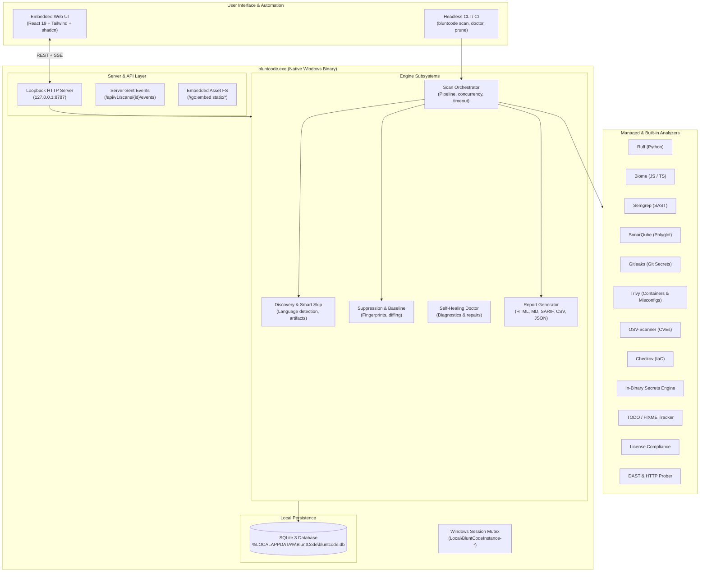

# Blunt Code — System Architecture & Feature Guide

> **Your code has problems. Blunt Code names them.**  
> Local-first code quality & security scanning for Windows — no cloud, no account, no telemetry.

---

## 1. Executive Summary & Design Philosophy

**Blunt Code** is a high-performance, local-first code analysis and application security platform built specifically for Windows 10 and 11. It packages 12 security, linting, code-quality, and dependency analyzers (11 static analyzers plus the Pentest Suite) into a single native binary and a modern loopback web interface, eliminating the traditional "PATH fights", external language runtimes (no system-wide Python, Java, or Node required), and cloud privacy compromises of conventional scanning solutions.

### Core Architectural Principles

- **100% Local & Private by Design**: Analysis runs entirely on the local workstation. The HTTP server binds exclusively to loopback (`127.0.0.1`). Findings stay in a local SQLite database (`%LOCALAPPDATA%\BluntCode\bluntcode.db`). Zero telemetry, zero cloud tracking, and zero source code exfiltration.
- **Batteries-Included Tool Management**: Analyzers are managed in an isolated local directory (`%LOCALAPPDATA%\BluntCode\tools`). Tools are downloaded over verified HTTPS with hardcoded SHA-256 signatures and executed in isolated child processes with isolated environments.
- **Deterministic & Reproducible Results**: Scans capture an immutable `ScanSnapshot` prior to execution. Fingerprints use stable content-addressed hashing (path, rule ID, normalized code line), ensuring suppressions, baselines, and historical comparisons remain stable across refactors and whitespace changes.
- **Smart Skip (Noise Elimination)**: Scanners should inspect source code written by humans, not compiler output or dependency bundles. Built-in heuristics automatically ignore generated code, build directories, vendor trees, lockfiles, and minified bundles before analyzers touch the disk.
- **Dual-Mode Operation**: The same core Go binary operates as an interactive local web application (`bluntcode`) and a headless, zero-dependency CI gate (`bluntcode scan --fail-on high+`).

---

## 2. High-Level Architecture & Topology

Blunt Code follows a hybrid desktop architecture: a native **Go backend daemon/CLI** communicating over loopback with an embedded **React 19 Single-Page Application (SPA)**.



### Execution Modes

1. **Desktop / Server Mode (`bluntcode [path] [--port 8787] [--no-browser]`)**:
   - Acquires the Windows user-session named mutex (`Local\BluntCodeInstance-<hash>`).
   - Starts the loopback HTTP server on port 8787 (or a user-specified port).
   - Automatically opens the default browser (unless `--no-browser` is specified).
   - If another instance is already running on that port, hands off the requested path to the existing instance and exits cleanly.
2. **Headless CLI / CI Mode (`bluntcode scan <path> [flags]`)**:
   - Bypasses the HTTP server and UI completely.
   - Runs discovery, dispatches analyzers, streams progress to `stderr`, and outputs formatted results (Markdown, SARIF, JSON, CSV, GitHub Annotations) to `stdout`.
   - Returns strict exit codes:
     - `0`: Success / no blocking issues.
     - `1`: Quality or security gate failed (e.g. `--fail-on high+` or `--max-findings 0`).
     - `2`: Command-line or configuration usage error.
3. **Diagnostic & Recovery Mode (`bluntcode doctor [--fix] [--json]`)**:
   - Inspects machine state: tool installations, SQLite integrity, data directories, Semgrep rule validity, and orphan processes.
   - `--fix` automatically heals corrupted rules, cleans up stale locks, and repairs missing directory layouts without manual user intervention.

---

## 3. Subsystem Architecture

### 3.1. Discovery & Smart Skip Pipeline (`internal/discovery`)

The discovery engine traverses the target repository to construct the list of candidate files and identify repository languages.

- **Artifact Directory Skip**: Automatically skips directories that contain build artifacts, dependencies, caches, or virtual environments:
  - `node_modules`, `dist`, `build`, `out`, `target`, `vendor`, `.venv`, `venv`, `obj`, `bin`, `.svelte-kit`, `.next`, `.nuxt`, `.turbo`, `.terraform`, `Pods`, `coverage`, `playwright-report`, `.git`.
- **File Pattern & Bundle Skip**: Automatically filters out compiled bundles, minified scripts, lockfiles, and generated files:
  - Bundles: `*.min.js`, `*.min.css`, `*.chunk.js`, `*.bundle.js`, `vendor.js`, and hash-suffixed bundler output (e.g., `index-BYsMzFRr.css`).
  - Lockfiles: `package-lock.json`, `pnpm-lock.yaml`, `yarn.lock`, `poetry.lock`, `Cargo.lock`, `composer.lock`.
  - Generated code: `*.pb.go`, `*_pb2.py`, `*.generated.ts`, `*.designer.cs`, `*.tsbuildinfo`.
- **Content-Based Minification Heuristic**: Any text file over 128 KiB containing a line longer than 500 characters is classified as minified output and excluded from code-smell analysis.
- **Hard Size Limits**: Files exceeding 10 MiB are skipped from AST parsing to prevent OOM and timeouts.
- **Custom Rule Engine**: Honors `.bluntcodeignore` and per-workspace include/exclude rules configured in the UI or database.

### 3.2. Analyzer Engine & Execution Adapters (`internal/analyzers`)

Every analyzer implements the `Analyzer` interface, ensuring strict isolation between scanner orchestration and tool specifics:

```go
type Analyzer interface {
    ID() string
    DisplayName() string
    Category() core.Category
    IsAvailable(ctx context.Context) bool
    Run(ctx context.Context, req Request) (*Result, error)
}
```

- **Isolated Execution**: Tools execute through `internal/process` with non-inherited environments, sanitized PATHs, and deterministic working directories.
- **Process Supervision**: Enforces wall-clock execution timeouts (default 10 minutes, configurable per profile or via `--timeout`).
- **Resilient Parsing**: Malformed scanner output (e.g. truncated JSON from an out-of-memory tool) is isolated; it records an analyzer warning rather than crashing the entire scan.

### 3.3. Scan Orchestration & Concurrency (`internal/scans`)

The scan coordinator executes scans in defined lifecycle phases:

1. **Snapshot Phase**: Captures workspace state, git commit SHA, active rules, and file paths into an immutable `ScanSnapshot`.
2. **Routing Phase**: Determines applicable analyzers based on detected languages, active profile (`quick`, `standard`, `deep`, `pentest`), and tool availability.
3. **Execution Phase**: Analyzers run sequentially by default; `--jobs N` switches to a bounded worker pool with at most N analyzer runs in flight.
4. **Fingerprinting & Normalization**: Maps disparate tool outputs into the unified `core.Finding` schema. Generates content-addressed SHA-256 fingerprints:
   $$\text{Fingerprint} = \text{SHA256}(\text{RuleID} + \text{NormalizedPath} + \text{ContextLineContent})$$
5. **Suppression & Baseline Diffing**:
   - Suppressed findings are marked `status: suppressed` and excluded from total counts, risk grades, and gate calculations.
   - When a `--baseline` (SARIF file or prior scan ID) is supplied, findings are matched against baseline fingerprints to partition results into **New**, **Fixed**, and **Persistent**.
6. **Persistence & Broadcast**: Commits the scan summary, runs, and findings to SQLite within an atomic transaction and broadcasts completion over SSE.

### 3.4. Persistence & Database Architecture (`internal/database`)

Persistence uses SQLite with WAL (Write-Ahead Logging) mode enabled for high-concurrency loopback reads:

- **`workspaces`**: Registered project roots, friendly names, tags, detected languages, and default profiles.
- **`workspace_rules`**: Custom include/exclude glob patterns per workspace.
- **`path_overrides`**: Explicit single-file mode overrides.
- **`scans`**: Scan metadata, profile, started/finished timestamps, candidate/selected file counts, and final severity counts (`critical`, `high`, `medium`, `low`, `info`).
- **`scan_runs`**: Execution telemetry per analyzer (status, exit code, duration in milliseconds, error summary).
- **`findings`**: Normalized issue records (rule ID, category, severity, file path, line/column span, message, remediation advice, fingerprint, suppression status).
- **`suppressions`**: Fingerprint-based suppression registry with human audit reasons and timestamps.
- **`app_settings`**: User preferences (theme, UI defaults, language locale, auto-update checks).

---

## 4. The 12 Analyzers & Detection Stack

| Analyzer | Type | Scope | Target Languages / Technologies | Focus |
|---|---|---|---|---|
| **Ruff** | Linter & Code Smell | Fast AST | Python 3.8+ | Unused imports, syntax errors, security anti-patterns, style violations |
| **Biome** | Linter & Formatter | Fast AST | JavaScript, TypeScript, JSX, TSX | React hooks rules, dead code, suspicious syntax, type safety |
| **Semgrep** | SAST | AST Pattern | Polyglot (JS/TS, Python, Go, Java, C#) | High-signal 25-rule security pack: SQL injection, SSRF, XSS, insecure deserialization |
| **SonarQube** | SAST & Quality | Engine | Polyglot (25+ languages) | Cognitive complexity, code smells, resource leaks, maintainability |
| **Gitleaks** | Secret Detection | Git History / Tree | All files | Committed API keys, OAuth tokens, private keys, AWS/Stripe credentials |
| **Built-in Secrets** | Secret Detection | Working Tree | All files | High-entropy strings + regex for AWS, GitHub, OpenAI, Anthropic, JWT, Slack, Stripe |
| **OSV-Scanner** | SCA / CVEs | Manifests | npm, PyPI, Go, Maven, Cargo, NuGet | Known vulnerabilities from the Open Source Vulnerability (OSV) database |
| **Trivy** | Container & Misconfig | Polyglot & Infra | Dockerfile, Kubernetes, Terraform, packages | Container CVEs, insecure root execution, missing security contexts |
| **Checkov** | IaC Security | Manifests | Terraform, CloudFormation, K8s, ARM | Infrastructure security policies, public S3 buckets, unencrypted disks |
| **TODO / FIXME** | Tech Debt | Polyglot (40+ file types) | Code comments | Tracking `TODO`, `FIXME`, `HACK`, `BUG`, `XXX` across source files |
| **License Detector** | Compliance | Repository | `LICENSE*`, headers, manifests | Copyleft detection (GPL/AGPL), license conflict audit, undeclared licenses |
| **Pentest Suite** | DAST Prober | Dynamic HTTP | Local & staging endpoints | Missing security headers (CSP, HSTS, CORS), TLS posture, cookie safety |

---

## 5. Frontend Architecture (`web/`)

The frontend is built with **React 19**, **TypeScript**, **Tailwind CSS**, and **shadcn/Radix UI** primitives, compiled via **Vite**.

### Design System & Layout
- **No Heavy External Router**: Custom lightweight router (`lib/router.ts`) mapping URL paths to views with full browser history support (`popstate`, `replaceState`).
- **Responsive AppShell**:
  - Sticky primary navigation with quick access to Home, Workspaces, and Search.
  - Overflow "More" menu with clean disclosure panels for narrow viewports.
  - Utility cluster (`.nav-utils`): Notifications center with badge, compact language dropdown (EN, ES, FR, DE, JA, HI), keyboard shortcuts trigger, and light/dark theme toggle.
- **Accessibility & Contrast**: Built to WCAG 2.2 AA standards with automated contrast validation (`npm run audit:contrast`).

### Key Views & Interfaces

1. **Dashboard (`HomePage.tsx`)**:
   - At-a-glance metrics: Total registered workspaces, scanned files, total findings.
   - Risk ledger: Workspaces ranked by weighted risk score (Critical ×10 + High ×5 + Medium ×2 + Low ×1) and letter grade (`A` through `D`).
   - Recent activity feed: Scan status timeline with severity breakdown dots and direct navigation.
2. **Workspaces (`WorkspacesPage.tsx`)**:
   - Single-line responsive filter bar with live debounced search, tag filtering, and sorting by name, last scan date, or finding count.
   - Workspace cards featuring detected language dots, tag pills with `+N` overflow, latest analysis status, and one-click quick scan triggers.
3. **Analysis Workbench (`ScanPage.tsx` & `report/ReportView.tsx`)**:
   - Split-pane layout: Interactive findings table on the left; docked source code viewer on the right with inline syntax highlighting.
   - Sticky filter toolbar: Instant filtering by severity (Critical, High, Medium, Low, Info), status (Active, Suppressed), category, and search query.
   - Actionable remediation: Clear explanations, suggested fixes, and one-click fingerprint / location copying.
4. **Unified Tools Page (`ToolsPage.tsx`)**:
   - Single consolidated table showing all managed and built-in analyzer engines.
   - Status, version, category badge, and one-click Install / Repair / Update controls.
5. **Rule Studio & File Exclusions (`FilesPage.tsx`)**:
   - Visual file tree explorer showing candidate files vs. excluded files.
   - Interactive rule authoring for custom inclusion/exclusion globs.
6. **Pentest Suite (`PentestPage.tsx`)**:
   - Interactive security testing dashboard for running DAST checks against local web services.
   - Analyzes HTTP security headers, CORS policies, cookie flags (`HttpOnly`, `Secure`, `SameSite`), and SSL/TLS configuration.
7. **Interactive CLI Manual (`CLIPage.tsx`)**:
   - Searchable reference guide for all CLI subcommands, arguments, and CI workflow templates.
   - Interactive Command Builder for generating production CI commands.

---

## 6. Reporting & Multi-Format Exports (`internal/reports`)

Blunt Code can export any scan or filtered finding set into standard industrial formats:

- **Standalone HTML (`html.go`)**: A single self-contained HTML file containing full styling, embedded SVG icons, and interactive vanilla JavaScript filtering. Requires zero network access or external CDNs to view.
- **SARIF v2.1.0 (`sarif.go`)**: Conforms to the OASIS Static Analysis Results Interchange Format. Plugs directly into GitHub Code Scanning alerts, VS Code SARIF viewer, and Azure DevOps.
- **Markdown (`markdown.go`)**: Clean, publication-ready summary tables and finding details optimized for PR comments, issue descriptions, and documentation.
- **CSV (`csv.go`)**: Tabular export honoring all active filters for spreadsheet analysis, compliance reporting, and executive reviews.
- **JSON & JSON Lines (`json.go`, `jsonl.go`)**: Complete structured AST representations for custom pipeline scripts and stream processors.
- **GitHub Workflow Annotations (`github.go`)**: Emits native `::error file=...,line=...::...` workflow command annotations directly into GitHub Actions step summaries.

---

## 7. Headless CLI & CI/CD Gating

Blunt Code provides enterprise CI/CD gating capabilities through its headless CLI:

```bash
# Run a standard scan and fail if any high or critical issues are found
bluntcode scan C:\projects\my-app --fail-on high+

# Run scan, output SARIF for GitHub Code Scanning, and enforce zero criticals
bluntcode scan . --format sarif --output results.sarif --fail-on critical

# Gate against a previous baseline (only fail on NEW findings)
bluntcode scan . --baseline previous-scan.sarif --fail-on high+

# Fast incremental scan with 4 parallel worker threads
bluntcode scan . --profile quick --jobs 4 --incremental
```

### Scan CLI Flags Reference

- `--profile <quick|standard|deep|pentest>`: Scan intensity and tool selection.
- `--fail-on <critical|high+|medium+|low+>`: Quality gate threshold.
- `--max-findings <N>`: Maximum allowable issues before exiting with status code 1.
- `--baseline <path.sarif|scan-id>`: Baseline diffing mode (ignores existing baseline issues).
- `--format <text|json|sarif|csv|jsonl|markdown|github>`: Output format.
- `--output <file>`: Write report to file instead of stdout.
- `--jobs <N>`: Bounded worker-pool concurrency (default 0 = sequential, one analyzer at a time).
- `--incremental`: Reuses cached findings for unmodified files.
- `--watch`: Continuously monitors directory and rescans on file changes.
- `--timeout <duration>`: Maximum scan duration before graceful cancellation.

---

## 8. Security & Privacy Model

- **Loopback Isolation**: The web server binds strictly to `127.0.0.1`. Requests originating from any other network interface are rejected at the TCP socket layer.
- **Single-Instance Enforcement**: A Windows session-level mutex prevents concurrent access to the SQLite database, preventing data corruption.
- **No Cloud Telemetry**: Zero analytics SDKs, zero crash-reporting pings, zero phone-home beacons.
- **Isolated Analyzer Execution**: Analyzers run under the user's local security context with read-only access to source trees, never modifying project files.
- **Sanitized HTML Rendering**: All finding messages, code snippets, and analyzer outputs undergo strict HTML-escaping and sanitization to prevent stored XSS attacks when viewing untrusted codebases.

